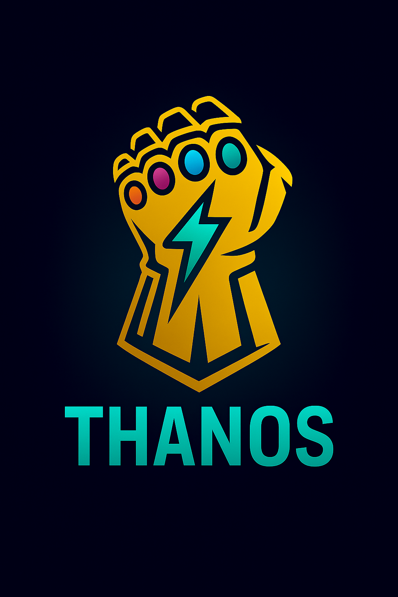

# Thanos

<div align="center">



**Unified AI Infrastructure Integration Layer**
*Intelligent routing • Provider discovery • MCP gateway*

</div>

---

## Badges


**AI Providers:**


**Technology:**


**Stack:**


---

## Overview

**Thanos** is a pure Zig orchestration layer that unifies AI infrastructure across the Ghost Stack:

- **Omen** - Intelligent multi-provider routing
- **Ollama** - Local AI model inference
- **Glyph** - MCP tool governance and execution
- **Bolt** - Container runtime with gRPC/QUIC transport
- **GVault** - Encrypted secrets and caching

Thanos provides:
- ✅ **Automatic provider discovery** - Detects Omen, Ollama, and other services
- ✅ **Smart routing** - Tries Omen first, falls back to local providers
- ✅ **MCP tool execution** - Executes tools via Bolt's gRPC/QUIC transport
- ✅ **Graceful degradation** - Works with or without Omen
- ✅ **Zero configuration** - Auto-detects endpoints and services
- ✅ **Library + CLI** - Use as Zig library or standalone tool

---

## Quick Start

### Build

```bash
cd /data/projects/thanos
zig build
```

### CLI Usage

```bash
# Discover available providers
./zig-out/bin/thanos discover

# Complete a prompt (auto-routes to best provider)
./zig-out/bin/thanos complete "fn main() "

# Show statistics
./zig-out/bin/thanos stats

# Version info
./zig-out/bin/thanos version
```

### Library Usage

```zig
const thanos = @import("thanos");

pub fn main() !void {
    var gpa = std.heap.GeneralPurposeAllocator(.{}){};
    defer _ = gpa.deinit();
    const allocator = gpa.allocator();

    // Initialize Thanos with auto-discovery
    const config = thanos.Config{
        .debug = true,
    };

    var ai = try thanos.Thanos.init(allocator, config);
    defer ai.deinit();

    // Complete a prompt (auto-routes)
    const request = thanos.CompletionRequest{
        .prompt = "fn main() ",
        .language = "zig",
        .max_tokens = 100,
    };

    const response = try ai.complete(request);
    defer response.deinit(allocator);

    if (response.success) {
        std.debug.print("Completion: {s}\n", .{response.text});
    }
}
```

---

## Architecture

```
┌─────────────────────────────────────────────────────────────┐
│                       Thanos Gateway                         │
│                                                               │
│  ┌─────────────┐    ┌──────────────┐    ┌───────────────┐  │
│  │  Discovery  │───▶│   Routing    │───▶│ MCP Execution │  │
│  └─────────────┘    └──────────────┘    └───────────────┘  │
└──────────┬───────────────────┬───────────────────┬──────────┘
           │                   │                   │
           ▼                   ▼                   ▼
    ┌────────────┐      ┌────────────┐      ┌────────────┐
    │   Omen     │      │   Ollama   │      │ Bolt+Glyph │
    │  (Router)  │      │   (Local)  │      │   (MCP)    │
    └────────────┘      └────────────┘      └────────────┘
           │                   │                   │
           └───────────────────┴───────────────────┘
                              │
                              ▼
                      AI Providers
              (Claude, GPT, Local Models)
```

### Routing Strategy

1. **If provider specified** → Use directly
2. **Else if Omen available** → Use Omen (intelligent routing)
3. **Else if Ollama available** → Use Ollama (fast local)
4. **Else** → Return error

### Discovery Process

On initialization, Thanos:
1. Checks Omen at `http://localhost:3000` (or configured endpoint)
2. Checks Ollama at `http://localhost:11434` (or configured endpoint)
3. Connects to Bolt gRPC at `127.0.0.1:50051` for MCP tools
4. Caches discovery results for session lifetime

---

## Configuration

```zig
pub const Config = struct {
    /// Omen endpoint (optional - auto-detects at localhost:3000)
    omen_endpoint: ?[]const u8 = null,

    /// Bolt gRPC endpoint for MCP tools
    bolt_grpc_endpoint: []const u8 = "127.0.0.1:50051",

    /// Ollama endpoint (optional - auto-detects at localhost:11434)
    ollama_endpoint: ?[]const u8 = null,

    /// Fallback providers if Omen unavailable
    fallback_providers: []const Provider = &.{.ollama},

    /// Provider discovery timeout (ms)
    discovery_timeout_ms: u32 = 2000,

    /// Enable debug logging
    debug: bool = false,
};
```

---

## Bolt Integration

Thanos is designed to work with containerized AI services via Bolt.

### Example Boltfile

See [`examples/Boltfile.toml`](examples/Boltfile.toml) for a complete setup:

```toml
# Run Glyph MCP server + Omen router in Bolt containers
[services.glyph]
image = "ghcr.io/ghostkellz/glyph:latest"
ports = ["50051:50051"]  # gRPC/QUIC

[services.omen]
image = "ghcr.io/ghostkellz/omen:latest"
ports = ["3000:3000"]
depends_on = ["glyph"]
```

Start the stack:
```bash
cd examples
bolt surge up
```

Thanos will auto-discover the services and route requests accordingly.

---

## Grim Editor Integration

Thanos can be used as a Grim editor plugin for AI-assisted coding.

### C ABI Export (Planned)

```zig
// Grim plugin interface
export fn thanos_init() ?*anyopaque;
export fn thanos_complete(handle: *anyopaque, prompt: [*:0]const u8) [*:0]const u8;
export fn thanos_deinit(handle: *anyopaque) void;
```

### Usage in Grim

```lua
-- Grim Lua config
local thanos = require('thanos')

-- Initialize AI assistant
local ai = thanos.init()

-- Complete at cursor
function complete_code()
    local line = vim.api.nvim_get_current_line()
    local completion = thanos.complete(ai, line)
    vim.api.nvim_put({completion}, 'c', true, true)
end

vim.keymap.set('n', '<leader>ai', complete_code)
```

---

## Project Structure

```
thanos/
├── src/
│   ├── root.zig               # Public API
│   ├── main.zig               # CLI tool
│   ├── types.zig              # Core types
│   ├── thanos.zig             # Orchestration logic
│   ├── discovery.zig          # Provider discovery
│   └── clients/
│       ├── omen_client.zig    # Omen HTTP client
│       ├── ollama_client.zig  # Ollama client
│       └── bolt_grpc_client.zig # Bolt gRPC client
├── examples/
│   └── Boltfile.toml          # Example Bolt stack
├── build.zig
├── build.zig.zon
└── README.md
```

---

## Dependencies

Thanos leverages the Ghost Stack ecosystem:

- **zontom** - Async primitives
- **zsync** - Synchronization utilities
- **zhttp** - HTTP client (for Omen/Ollama)
- **zrpc** - gRPC client (for Bolt)
- **rune** - MCP client library

All dependencies are automatically fetched via `zig build`.

---

## Development Status

| Component | Status | Notes |
|-----------|--------|-------|
| Core orchestration | ✅ Complete | Routing and discovery working |
| Provider discovery | ✅ Complete | Omen + Ollama detection |
| Ollama client | 🚧 Scaffold | HTTP client TODO |
| Omen client | 🚧 Scaffold | HTTP client TODO |
| Bolt gRPC client | 🚧 Scaffold | gRPC client TODO |
| CLI tool | ✅ Complete | All commands implemented |
| Grim plugin | ⏳ Planned | C ABI exports pending |

---

## Roadmap

### Phase 1 - Core ✅
- [x] Project structure
- [x] Provider discovery
- [x] Routing logic
- [x] CLI tool
- [x] Basic testing

### Phase 2 - Clients 🚧
- [ ] Implement Ollama HTTP client
- [ ] Implement Omen HTTP client
- [ ] Implement Bolt gRPC client
- [ ] Add retry logic and timeouts
- [ ] Connection pooling

### Phase 3 - Integration ⏳
- [ ] Grim C ABI plugin
- [ ] Bolt container images
- [ ] End-to-end testing
- [ ] Performance benchmarks
- [ ] Documentation

---

## Why Thanos?

**The name**: In Marvel lore, Thanos wields the Infinity Gauntlet to harness all infinity stones. Similarly, **Thanos** unifies all Ghost Stack components into one cohesive AI infrastructure.

**The philosophy**: Don't reinvent wheels. Orchestrate existing battle-tested components (Omen, Glyph, Bolt, Rune) into a seamless experience.

---

## License

Part of the Ghost Stack ecosystem.

**Author**: ghostkellz
**Language**: Zig 0.16+
**Status**: Active development
